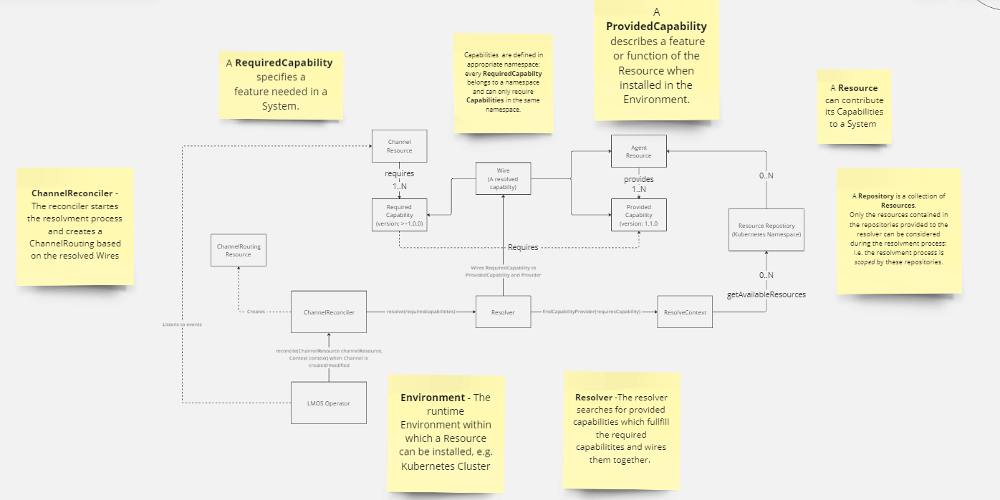

# lmos-operator


[](https://www.apache.org/licenses/LICENSE-2.0)
[](CODE_OF_CONDUCT.md)


The LMOS Operator is a Kubernetes operator designed to dynamically resolve Channel requirements based on the capabilities of installed Agents within a Kubernetes cluster (environment).

A “Channel” refers to a digital interface that enables communication between an AI system and its users. Channels can be diverse, such as web, mobile apps, IVR systems, or messaging platforms, each potentially requiring different sets of capabilities.

For instance, a web channel might need a comprehensive set of customer support capabilities, while an IVR channel might only start with a subset of the customer support capabilities. Additionally, the LMOS Operator supports advanced deployment strategies like canary releases, allowing new Agent capabilities to be rolled out gradually to a subset of users within a Channel.

The LMOS Operator enables defining which capabilities should be provided through channels and dynamically resolves which Agents are providing these capabilities. This dynamic resolution ensures that the right capabilities are always available in the Kubernetes cluster (environment).

The following diagram illustrates how the lmos-operator dynamically manages and resolves capabilities within a Kubernetes environment. It shows the interaction between Channel, Agent, Repository, and the reconciler processes to ensure that required capabilities are matched with installed Agent resources.



## Concepts and Relationships

1. **Channel Resource**:
    - Defines `RequiredCapabilities` which are capabilities needed by the channel.
    - Each `RequiredCapability` specifies a version constraint.

2. **Agent Resource**:
    - Defines `ProvidedCapabilities` which describe the capabilities the agent offers.
    - Each `ProvidedCapability` specifies a version.

3. **Wire**:
    - Represents a resolved capability, connecting a `RequiredCapability` to a `ProvidedCapability` and its provider.

4. **ChannelReconciler Process**:
    - When a `Channel` resource is created or modified, the `ChannelReconciler` listens to these events.
    - The `ChannelReconciler` starts the resolution process by invoking the `Resolver`.
    - The `Resolver` searches for `ProvidedCapabilities` that match the `RequiredCapabilities`.
    - The `Resolver` uses the Kubernetes API (scoped to the Kubernetes namespace) to find available resources.
    - The `Resolver` creates a `ResolveContext` to maintain the context of the resolution process.

5. **ChannelRouting Resource**:
    - Once the capabilities are resolved, the `ChannelReconciler` creates a `ChannelRouting` resource.
    - The `ChannelRouting` resource maps required capabilities to their provided versions and specifies the hosts providing these capabilities.

### Example Resources

#### Agent Resource

```yaml
apiVersion: lmos.ai/v1
kind: Agent
metadata:
name: de-billing-agent
spec:
description: This is the billing agent description
supportedTenants:
- de
- at
supportedChannels:
- web
- oneapp
- ivr
providedCapabilities:
- name: view-bill
version: 1.0.0
description: Capability to view a bill
- name: download-bill
version: 1.1.0
description: Capability to download a bill
```

#### Channel Resource

```yaml
apiVersion: lmos.ai/v1
kind: Channel
metadata:
  name: de-oneapp-stable
  labels:
    channel: oneapp
    version: 1.0.0
    tenant: de
    subset: stable
spec:
  requiredCapabilities:
    - name: view-bill
      version: "1.0.0"
    - name: download-bill
      version: ">=1.0.0"
      strategy: HIGHEST
    - name: view-contract
      version: ">=1.0.0"
```

#### Generated ChannelRouting 

```yaml
apiVersion: "lmos.ai/v1"
kind: "ChannelRouting"
metadata:
  name: "de-oneapp-stable"
  namespace: "test"
  labels:
    version: "1.0.0"
    tenant: "de"
    channel: "oneapp"
    subset: "stable"
spec:
  capabilityGroups:
  - name: "de-contract-agent"
    description: "This is the contract agent description"
    capabilities:
    - name: "view-contract"
      requiredVersion: ">=1.0.0"
      providedVersion: "1.1.0"
      description: "Capability to view a contract"
      host: "de-contract-agent-stable-svc"
  - name: "de-billing-agent"
    description: "This is the billing agent description"
    capabilities:
    - name: "view-bill"
      requiredVersion: "1.0.0"
      providedVersion: "1.0.0"
      description: "Capability to view a bill"
      host: "de-billing-agent-stable-svc"
    - name: "download-bill"
      requiredVersion: ">=1.0.0"
      providedVersion: "1.1.0"
      description: "Capability to download a bill"
      host: "de-billing-agent-stable-svc"
```

### Supported version range syntaxes

NPM-style
* Primitive ranges <, <=, >, >= and =
* X-Ranges 1.2.x, 1.X, 1.2.* and *
* Tilde ranges ~1.2.3, ~1.2 and ~1
* Caret ranges ^1.2.3, ^0.2.5 and ^0.0.4

Ivy-style
* Version Range Matcher [1.0,2.0], [1.0,2.0[, ]1.0,2.0], ]1.0,2.0[, [1.0,), ]1.0,), (,2.0] and (,2.0[* 

## How to install on a Kubernetes cluster:

```
export CR_PAT=YOUR_TOKEN
echo $CR_PAT | docker login ghcr.io -u USERNAME --password-stdin
```
```
helm install lmos-operator oci://ghcr.io/lmos-ai/lmos-operator-chart --version <current_version> --set imageCredentials.username=<github_user> --set imageCredentials.password=<github_pat>
```

Check that CRDs are created:

```
kubectl get crds
```

Expected output:
```
NAME                      CREATED AT
agents.lmos.ai            2024-07-31T13:08:34Z
channelrollouts.lmos.ai   2024-07-31T13:08:32Z
channelroutings.lmos.ai   2024-07-31T13:08:36Z
```

## How to test locally with Minikube:

Install [Minikube](https://minikube.sigs.k8s.io/docs/start)

```
minikube start
```

Clone and start the operator:

```
git clone https://github.com/lmos-ai/lmos-operator
cd lmos-operator
./gradlew bootRun
```

Apply Agent and Channel test resources:

```
kubectl apply -f src/test/resources/billing-agent-v1.yaml
kubectl apply -f src/test/resources/contract-agent-v1.yaml
kubectl apply -f src/test/resources/oneapp-channel-v1.yaml
```

Check that the Agents and Channel have been created:

```
kubectl get agents
kubectl get channels
```

Expected output:
```
NAME                      AGE
de-billing-agent-stable   4m40s
de-contract-agent         4m3s

NAME               RESOLVE_STATUS
de-oneapp-stable   RESOLVED
```

Check that the lmos-operator has created a ChannelRouting:
```
kubectl get channelroutings
```

Render the ChannelRouting as yaml
```
kubectl get channel de-oneapp-stable -o yaml
```

## Code of Conduct

This project has adopted the [Contributor Covenant](https://www.contributor-covenant.org/) in version 2.1 as our code of conduct. Please see the details in our [CODE_OF_CONDUCT.md](CODE_OF_CONDUCT.md). All contributors must abide by the code of conduct.

By participating in this project, you agree to abide by its [Code of Conduct](./CODE_OF_CONDUCT.md) at all times.

## Licensing
Copyright (c) 2024 Deutsche Telekom AG.

Sourcecode licensed under the [Apache License, Version 2.0](https://www.apache.org/licenses/LICENSE-2.0) (the "License"); you may not use this project except in compliance with the License.

This project follows the [REUSE standard for software licensing](https://reuse.software/).    
Each file contains copyright and license information, and license texts can be found in the [./LICENSES](./LICENSES) folder. For more information visit https://reuse.software/.

Unless required by applicable law or agreed to in writing, software distributed under the License is distributed on an "AS IS" BASIS, WITHOUT WARRANTIES OR CONDITIONS OF ANY KIND, either express or implied. See the LICENSE for the specific language governing permissions and limitations under the License.
